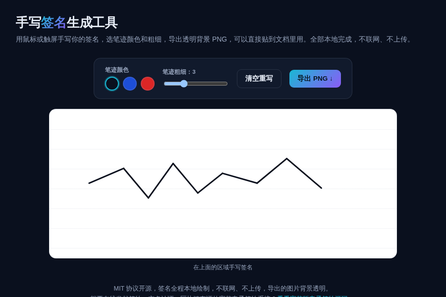

# 手写签名生成工具 · Signature Pad

**[在线体验 →](https://anna123123123-creator.github.io/signature-pad/)**

免费开源、纯浏览器运行的手写签名生成工具。用鼠标或触屏手写签名，选笔迹颜色和粗细，导出透明背景 PNG，可以直接贴到文档、PDF、邮件签名里用。全部本地绘制，不联网、不上传。



## 试用方法

直接用浏览器打开 `index.html`（触屏设备可以直接用手指写），或用静态文件服务器跑起来：

```bash
python3 -m http.server 8000
```

## 实现原理

用 Pointer Events（同时兼容鼠标和触屏）监听绘制轨迹，在 Canvas 上实时画线。画布背景本身是透明的，页面上看到的白色方格纸效果是 CSS 背景，不会被导出进图片，所以导出的 PNG 天然是透明背景。`script.js` 里大概 80 行原生 JavaScript。

## 协议

MIT。

## 相关项目

这个是做 **电子签约系统**产品时顺手做的免费小工具——只能画一张签名图片，不具备身份核验、合同流转、区块链存证这些法律效力保障。完整版是在线发起、实名认证、手写签名、区块链存证的完整电子签约系统，源码在这：[全能源码 · 电子签约系统源码](https://inzyxuashop.com/dianziqianyue-yuanma.html)。
